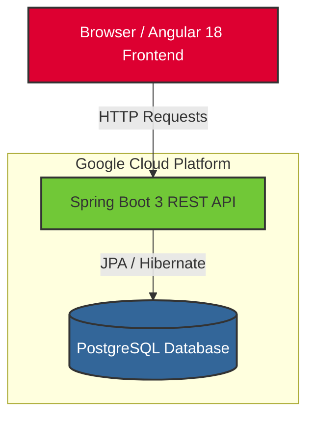

# Appointment Booking System

A production-grade Appointment Booking System demonstrating concurrency control, full-stack architecture, and cloud deployment. 

## Architecture Diagram



## Local Setup Instructions

1. **Prerequisites:**
   - Docker and Docker Compose
   - Java 21+
   - Node.js 20+

2. **Start the Local Database:**
   Run the following command in the root directory to spin up the local PostgreSQL container.
   ```bash
   docker-compose up -d
   ```
   This will start a PostgreSQL database accessible on `localhost:5432` with credentials (`postgres`/`password`) and database `appointment_db`.

3. **Run the Backend:**
   Open a new terminal in the `backend` directory and start the Spring Boot application:
   ```bash
   cd backend
   ./mvnw spring-boot:run
   ```
   The backend will be available at `http://localhost:8080`.

4. **Run the Frontend:**
   Open another terminal in the `frontend` directory and start the Angular development server:
   ```bash
   cd frontend
   npm install
   npm start
   ```
   The frontend will be available at `http://localhost:4200`.

## Double-Booking Prevention

One of the primary challenges in building a booking system is preventing double bookings when multiple users attempt to secure the same appointment slot simultaneously. 

Instead of relying solely on application-level locks (which can fail in distributed environments) or synchronized blocks, this system employs a robust **database-level unique constraint**.

In the `Appointment` entity, a composite unique constraint is enforced on the `branch_id` and `slot_time`:
```java
@Table(uniqueConstraints = {
    @UniqueConstraint(columnNames = {"branch_id", "slotTime"})
})
public class Appointment { ... }
```

When two concurrent requests attempt to save an appointment for the same branch and time, the database guarantees that only one transaction succeeds. The second transaction triggers a `DataIntegrityViolationException`, which the backend intercepts to return a clean `HTTP 409 Conflict` to the client. The frontend then alerts the user to select another time slot.

---

## Google Cloud Platform (GCP) Deployment

The following `gcloud` CLI commands can be used to deploy this application to Google Cloud Run and Google Cloud SQL.

### 1. Provision a Cloud SQL (PostgreSQL) Instance

```bash
# Set project ID and region variables
PROJECT_ID="your-gcp-project-id"
REGION="us-central1"
INSTANCE_NAME="appointment-db-instance"

# Create the Cloud SQL PostgreSQL instance
gcloud sql instances create $INSTANCE_NAME \
    --database-version=POSTGRES_15 \
    --tier=db-f1-micro \
    --region=$REGION \
    --project=$PROJECT_ID

# Create the application database
gcloud sql databases create appointment_db \
    --instance=$INSTANCE_NAME \
    --project=$PROJECT_ID

# Create a database user (replace with a secure password)
gcloud sql users create db_user \
    --instance=$INSTANCE_NAME \
    --password="secure_password" \
    --project=$PROJECT_ID
```

### 2. Build the Docker Image via Google Cloud Build

```bash
# Configure Docker to use gcloud credentials (if needed)
gcloud auth configure-docker ${REGION}-docker.pkg.dev

# Define the artifact registry repository and image name
REPO_NAME="appointment-repo"
IMAGE_NAME="${REGION}-docker.pkg.dev/${PROJECT_ID}/${REPO_NAME}/appointment-app:v1"

# Create Artifact Registry repo (if it doesn't exist)
gcloud artifacts repositories create $REPO_NAME \
    --repository-format=docker \
    --location=$REGION \
    --description="Docker repository for Appointment System" \
    --project=$PROJECT_ID

# Submit the build to Cloud Build
gcloud builds submit --tag $IMAGE_NAME . \
    --project=$PROJECT_ID
```

### 3. Deploy the Container to Google Cloud Run

```bash
# Note: Ensure the Cloud SQL Admin API is enabled and your Cloud Run service account has the Cloud SQL Client role.

# Get the instance connection name
INSTANCE_CONNECTION_NAME=$(gcloud sql instances describe $INSTANCE_NAME --project=$PROJECT_ID --format="value(connectionName)")

# Deploy to Cloud Run
gcloud run deploy appointment-booking-app \
    --image=$IMAGE_NAME \
    --region=$REGION \
    --platform=managed \
    --allow-unauthenticated \
    --set-env-vars=SPRING_DATASOURCE_URL=jdbc:postgresql:///${INSTANCE_NAME}?cloudSqlInstance=${INSTANCE_CONNECTION_NAME}&socketFactory=com.google.cloud.sql.postgres.SocketFactory,SPRING_DATASOURCE_USERNAME=db_user,SPRING_DATASOURCE_PASSWORD=secure_password \
    --add-cloudsql-instances=$INSTANCE_CONNECTION_NAME \
    --project=$PROJECT_ID
```
